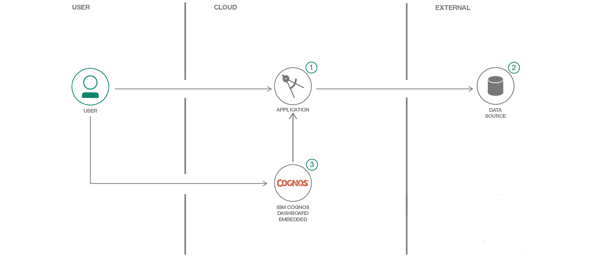

# Getting Started with CDE on IBM Cloud

This repo shows a Angular 5.0.0 + Node.js app that demos the IBM Cloud CDE service.

## Architecture


## Prerequisites

* [Git](https://git-scm.com/downloads)
* [IBM Cloud CLI](https://console.bluemix.net/docs/cli/reference/bluemix_cli/all_versions.html#bluemix-cli-installer-downloads)
* [Node v6.9.0 or higher](https://nodejs.org/en/)


## Deployment

In order to deploy to IBM Cloud, you'll need an [IBM Cloud account](https://console.ng.bluemix.net/registration/). There are then 2 options to deploy.

### Option 1:
Automatically deploy the app using the following deploy to IBM Cloud button.

[](https://console.bluemix.net/devops/setup/deploy?repository=https://github.com/IBM/cognos-dashboard-demo)


### Option 2:
To run locally and deploy manually from the command line, follow the instructions below.

#### Repo setup

Getting started:

```bash
$ git clone
$ npm install
```

#### Running

Before running locally, please make sure to:
1. Create a new CDE instance and service credentials in IBM Cloud
1. Ensure that vcap-local.json contains the CDE credentials

```bash
$ npm run build
```

#### Manual Deployment Steps

Use the bx cli to deploy into IBM Cloud:
1. Create a new Node.JS Cloud Foundry application in IBM Cloud (https://console.bluemix.net/)
1. Update manifest.yml and environment / config values
1. Build locally using ```npm run build``` or ```npm run build-prod```
1. Navigate to the app folder
1. Issue command to set ```api endpoint: bx api <API-endpoint>``` (US South https://api.ng.bluemix.net)
1. Issue command to login: ```bx login```
1. Follow the prompts to enter IBM Cloud credentials, select account, and target Cloud Foundry org/space
1. Issue command to push: ```bx cf push```


## Angular setup (front-end only)

### Build
Run ```ng build``` to build the project. The build artifacts will be stored in the `dist/` directory. Use the `-prod` flag for a production build.

### Development server

Run ```ng serve``` for a dev server. Navigate to http://localhost:4200/. The app will automatically reload if you change any of the source files.

# Resources

* [CDE in IBM Cloud](https://console.bluemix.net/docs/services/cognos-dashboard-embedded/index.html#overview-of-cognos-dashboard-embedded)
* [Sample app](https://dde-us-south.analytics.ibm.com/daas/DashboardAPI.html)
* [Swagger](https://dde-us-south.analytics.ibm.com/api-docs)
* [API Documentation](https://dde-us-south.analytics.ibm.com/daas/jsdoc/cognos/api/CognosApi.html)


## License

This code pattern is licensed under the Apache Software License, Version 2.  Separate third party code objects invoked within this code pattern are licensed by their respective providers pursuant to their own separate licenses. Contributions are subject to the [Developer Certificate of Origin, Version 1.1 (DCO)](https://developercertificate.org/) and the [Apache Software License, Version 2](http://www.apache.org/licenses/LICENSE-2.0.txt).

[Apache Software License (ASL) FAQ](http://www.apache.org/foundation/license-faq.html#WhatDoesItMEAN)