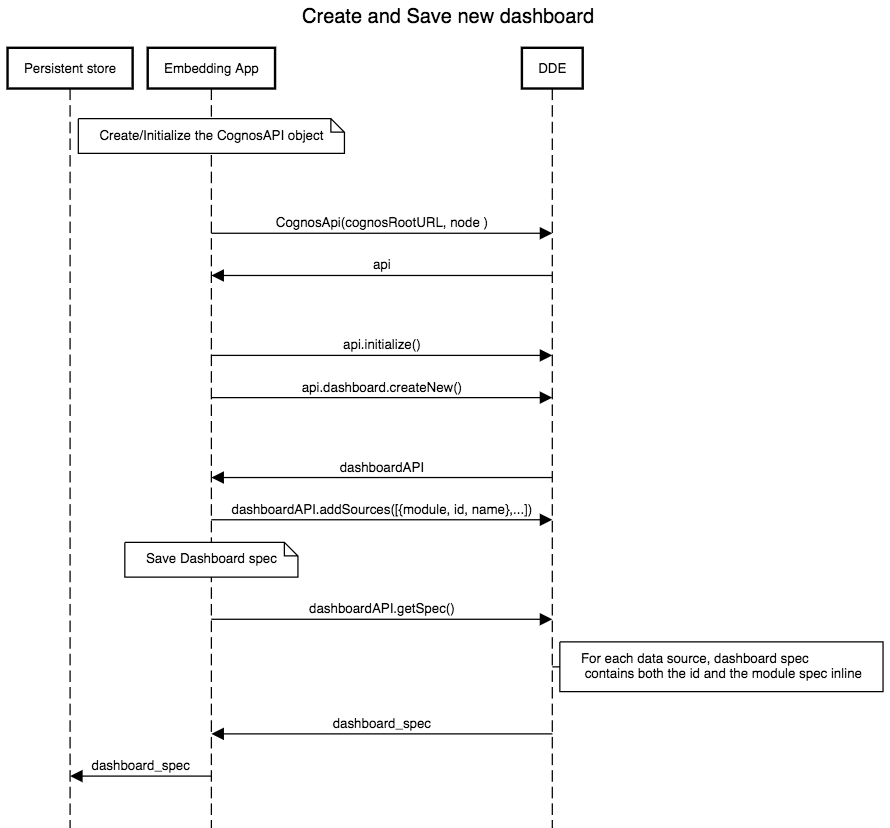
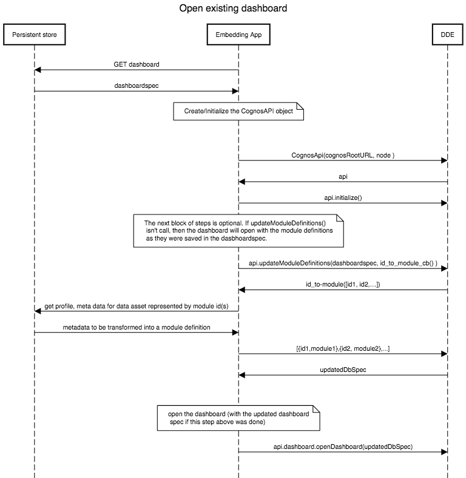

# Getting Started with DDE on IBM Cloud

This repo shows a Angular 5.0.0 + Node.js app that demos the IBM Cloud DDE service.

## Architecture (Create and Save new dashboard)


## Architecture (Open existing dashboard)


## Prerequisites

* [Git](https://git-scm.com/downloads)
* [IBM Cloud CLI](https://console.bluemix.net/docs/cli/reference/bluemix_cli/all_versions.html#bluemix-cli-installer-downloads)
* [Node v6.9.0 or higher](https://nodejs.org/en/)


## Deployment

In order to deploy to IBM Cloud, you'll need an [IBM Cloud account](https://console.ng.bluemix.net/registration/). There are then 2 options to deploy.

### Option 1:
Automatically deploy the app using the following deploy to IBM Cloud button.

[](https://console.bluemix.net/devops/setup/deploy?repository=https://github.com/IBM/dynamic-dashboard-demo&branch=deploy-ibmcloud)


### Option 2:
To run locally and deploy manually from the command line, follow the instructions below.

#### Repo setup

Getting started:

```bash
$ git clone
$ npm install
```

#### Running

Before running locally, please make sure to:
1. Create a new DDE instance and service credentials in IBM Cloud
1. Ensure that vcap-local.json contains the DDE credentials

```bash
$ npm run build
```

#### Manual Deployment Steps

Use the bx cli to deploy into IBM Cloud:
1. Create a new Node.JS Cloud Foundry application in IBM Cloud (https://console.bluemix.net/)
1. Update manifest.yml and environment / config values
1. Build locally using ```npm run build``` or ```npm run build-prod```
1. Navigate to the app folder
1. Issue command to set ```api endpoint: bx api <API-endpoint>``` (US South https://api.ng.bluemix.net)
1. Issue command to login: ```bx login```
1. Follow the prompts to enter IBM Cloud credentials, select account, and target Cloud Foundry org/space
1. Issue command to push: ```bx cf push```


## Angular setup (front-end only)

### Build
Run ng build to build the project. The build artifacts will be stored in the dist/ directory. Use the -prod flag for a production build.

### Development server

Run ng serve for a dev server. Navigate to http://localhost:4200/. The app will automatically reload if you change any of the source files.

# Resources

* [DDE in IBM Cloud](https://console-regional.ng.bluemix.net/docs/services/dynamic-dashboard-embedded/index.html#overview-of-dynamic-dashboard-embedded)
* [Sample app](https://dde-us-south.analytics.ibm.com/daas/DashboardAPI.html)
* [Swagger](https://dde-us-south.analytics.ibm.com/api-docs)
* [API Documentation](https://dde.us-south.containers.mybluemix.net/daas/jsdoc/cognos/api/index.html)


